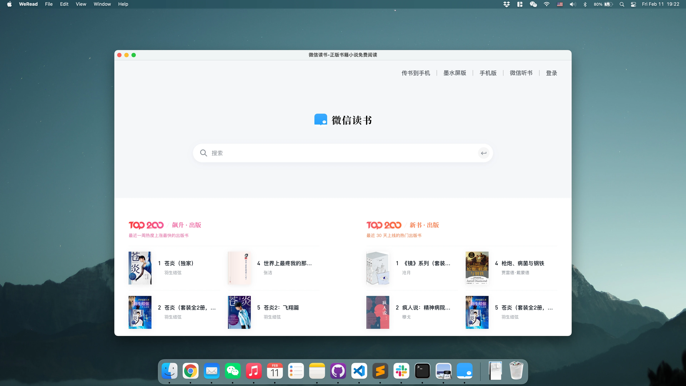

# 微信读书桌面版客户端 / WeRead_Desktop

微信读书网页版桌面客户端（非官方）/ WeRead Desktop App (Unofficial)

[English README](README.md)



## 项目介绍

WeRead Desktop 是官方[微信读书网页版](https://weread.qq.com/)的轻量 Electron 外壳。它在 macOS、Windows 和 Linux 上提供独立桌面窗口，阅读、账户和书架等功能仍完全由微信读书网站提供。

> 本项目与腾讯及微信读书没有隶属或授权关系。登录信息和阅读数据保存在独立的 Chromium 网站会话中，本项目不会读取这些内容。

## 功能

- 支持 macOS（Intel 和 Apple Silicon）、Windows 10 或更高版本以及 Linux。
- 保留现有登录会话，并恢复上次的窗口位置和尺寸。
- 提供主页、后退、前进、刷新、重试、关于和检查更新等原生菜单。
- 微信读书离线或渲染进程异常时显示本地恢复页面。
- 只有 `https://weread.qq.com` 保留在应用内，其他由用户点击的 HTTPS 链接使用默认浏览器打开。
- 使用 Electron 沙盒和 context isolation，不启用 Node.js 集成或 preload 桥接。
- 不申请摄像头、麦克风、位置、通知、设备或文件系统权限。
- 默认每月检查一次 GitHub Releases；自动检查可设置为每天、每周、每月或完全关闭，并始终保留手动检查功能。
- 不包含遥测、广告、网页注入脚本或微信读书原生 API 集成。

## 更新内容

### v1.1.0

- 从 Electron 33 升级至 Electron 44。
- 增加严格的导航、弹窗、重定向和网页权限控制。
- 增加单实例运行、窗口状态恢复、原生导航菜单以及离线/崩溃恢复页面。
- 增加可配置的更新提醒，仅跳转到固定的 GitHub Releases 页面，不会自动下载或安装。
- 增加依赖锁定、自动化测试、依赖审计、安装包内容检查和 Electron fuse 验证。
- 增加 GitHub Actions 自动构建 macOS 通用版、Windows x64 和 Linux x64，并生成 SHA-256 校验值和明确标注的未签名文件。
- 删除未使用的依赖和空的 preload 脚本。
- 关闭 Electron Cookie 加密，避免触发 macOS 钥匙串提示。

v1.1.0 的代码审查、实现、测试和发布加固工作由 OpenAI Codex 辅助完成。

之前的版本：

- v1.0.4 修复书架分组无法打开的问题，并更新 Electron 和 electron-builder。
- v1.0.3 更新 Electron 和 electron-builder。
- v1.0.2 改用 electron-builder，并增加 Apple Silicon、Windows 和 Linux 支持。
- v1.0.1 更新文档。
- v1.0.0 为最初的 Intel macOS 版本。

## 下载

请从 [GitHub Releases](https://github.com/NeilYXIN/WeRead_Desktop/releases/latest) 下载最新版本。

| 平台 | 架构 | 格式 |
| --- | --- | --- |
| macOS | Intel + Apple Silicon（通用版） | DMG |
| Windows 10 或更高版本 | x64 | NSIS 安装程序 |
| Linux | x64 | AppImage 和 deb |

Release 文件包含 SHA-256 校验值和签名状态说明。配置签名证书后，macOS 和 Windows 文件会自动签名。文件名以 `-unsigned` 结尾表示操作系统可能显示常规的未签名安全提示。

## 安装

### macOS

下载通用版 DMG，打开后将 WeRead 拖入“应用程序”文件夹。未签名版本可能需要在 macOS“隐私与安全性”设置中明确允许。

### Windows

下载并运行 x64 安装程序。安装包未签名时，Windows SmartScreen 可能显示警告。

### Linux

使用系统包管理器安装 deb，或为 AppImage 添加执行权限后直接运行。

## 开发和构建

需要 Node.js 24 和 npm。

```sh
npm ci
npm start
```

运行本地检查：

```sh
npm run check
npm run audit
```

在对应原生平台构建：

```sh
npm run dist:mac
npm run dist:win
npm run dist:linux
```

推荐使用 GitHub Actions 同时构建三个平台。在 Actions 页面手动运行 **Release** workflow，会生成不会公开发布的候选安装包。完成测试后，推送一个与 `package.json` 版本一致的 `vX.Y.Z` 标签，即可构建并发布 GitHub Release。完整步骤请参阅 [Release 检查清单](docs/RELEASE_CHECKLIST.md)。

## 安全和隐私

只有精确的 `https://weread.qq.com` 来源可以在应用内导航。其他 HTTPS 链接仅在用户操作后交给系统浏览器；HTTP、包含账号信息、格式错误、本地文件、JavaScript 和自定义协议地址会被阻止。网页权限默认拒绝，仅允许微信读书主页面使用全屏和安全剪贴板写入。

为了让老用户保持登录，程序会继续使用原有的会话分区名称。应用自行保存的状态只有窗口位置、尺寸、更新检查时间和更新检查偏好。Electron Cookie 加密已关闭，以避免触发 macOS 钥匙串提示；网站会话数据仍保存在操作系统用户账户下的 Chromium 本地配置中。

## 说明

本项目仍是一个方便访问微信读书官方网站的小型业余项目。欢迎提交贡献、问题和建议。

## 许可证

[MIT](LICENSE)
